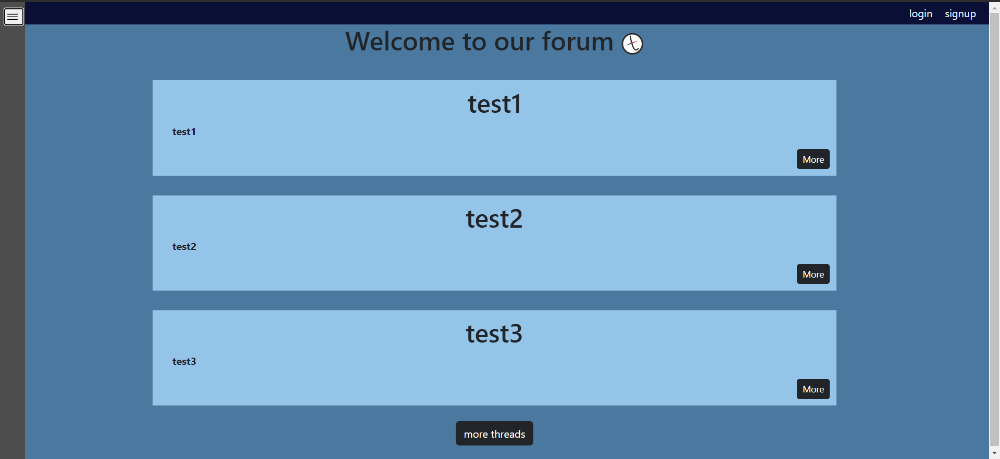

# Around the world

Welcome to the Around the world Forum! This forum is a place for travel enthusiasts to connect, share experiences, and inspire each other's wanderlust.

## Table of Contents

- [Around the world](#around-the-world)
  - [Table of Contents](#table-of-contents)
  - [About](#about)
  - [Features](#features)
  - [Getting Started](#getting-started)
  - [Usage](#usage)
  - [Contributing](#contributing)
  - [License](#license)

## About

Around the world Forum is an online community where travelers from all around the world can come together to discuss their adventures, ask for advice, and showcase their travel stories through text and images.

## Features

- Create and customize your user profile.
- Start new travel-related discussions or join existing ones.
- Share your travel itineraries and tips.
- Upvote and comment on posts.

## Getting Started

Follow these steps to get started with Travelers' Hub Forum:

1. Clone the repository: `git clone https://github.com/Vasya-556/ATW.git`
2. Install dependencies: `pip install -r requirements.txt`
3. Set up your database and environment variables (refer to `atw/settings.py`).
4. Apply database migrations: `python manage.py migrate`
5. Create a superuser account: `python manage.py createsuperuser`
6. Run the development server: `python manage.py runserver`

## Usage

Once the forum is up and running, you can access it through your web browser. Create an account or log in to start participating in discussions, sharing your travel stories, and connecting with other travelers.

Here's a quick example of how to create a new thread:

1. Log in to your account.
2. Open sidebar
3. Press 'New thread'
4. Write a catchy title and detailed content for your thread.
5. Hit the "Post this" button to publish your thread.

## Contributing

We welcome contributions from the community! If you'd like to contribute to Travelers' Hub Forum, please follow these steps:

1. Fork the repository.
2. Create a new branch: `git checkout -b feature/your-feature-name`
3. Make your changes and test them.
4. Commit your changes: `git commit -m "Add your brief commit message"`
5. Push to the branch: `git push origin feature/your-feature-name`
6. Create a pull request to the `main` branch of this repository.

## License

This project is licensed under the MIT License - see the [LICENSE](LICENSE) file for details.